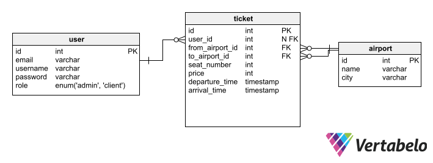

# Data Modeling

## Content

- [Entity Relationship Diagram](#entity-relationship-diagram)
- [Tables](#tables)
  - [Admin](#1-admin)
  - [Airport](#2-airport)
  - [Booking](#3-booking)
  - [Booking_Flights](#4-booking-flights)
  - [City](#5-city)
  - [Route](#6-route)
  - [Ticket](#7-ticket)
  - [User](#8-user)
- [Relationships](#relationships)

-----

## Entity Relationship Diagram

## Tables

### 1. Admin

| Key | Column Name | Data Type | Description                       |
|-----|-------------|-----------|-----------------------------------|
| PK  | id          | int       | Primary key for Admin record      |
|     | user_id     | int       | User ID linked to this admin      |

### 2. Airport

| Key | Column Name | Data Type | Description                      |
|-----|-------------|-----------|----------------------------------|
| PK  | id          | int       | Primary key for Airport record   |
|     | name        | varchar   | Name of the airport               |
|     | city_id     | int       | City ID linked to this airport   |

### 3. Booking

| Key | Column Name | Data Type | Description                         |
|-----|-------------|-----------|-------------------------------------|
| PK  | id          | int       | Primary key for Booking record      |
|     | from_city_id | int      | City ID for the departure city      |
|     | to_city_id   | int      | City ID for the destination city    |
|     | total_price  | int       | Total price of the booking          |
|     | user_id      | int       | User ID linked to this booking      |
|     | date         | int       | Date of the booking                 |

### 4. Booking_Flights
Association table linking Booking and Ticket.

| Key | Column Name  | Data Type | Description                        |
|-----|--------------|-----------|------------------------------------|
| FK  | booking_id   | int       | Foreign key to Booking table       |
| FK  | ticket_id    | int       | Foreign key to Ticket table        |
|     | flight_order | int       | Order of the flight in the booking |

### 5. City

| Key | Column Name | Data Type | Description                      |
|-----|-------------|-----------|----------------------------------|
| PK  | id          | int       | Primary key for City record      |
|     | name        | varchar   | Name of the city                 |

### 6. Route

| Key | Column Name    | Data Type | Description                           |
|-----|----------------|-----------|---------------------------------------|
| PK  | id             | int       | Primary key for Route record          |
|     | from_airport_id| int       | Airport ID for the departure airport  |
|     | to_airport_id  | int       | Airport ID for the destination airport|

### 7. Ticket

| Key | Column Name    | Data Type  | Description                            |
|-----|----------------|------------|----------------------------------------|
| PK  | id             | int        | Primary key for Ticket record          |
|     | route_id       | int        | Route ID linked to this ticket         |
|     | price          | int        | Price of the ticket                    |
|     | departure_time | timestamp  | Departure time of the flight           |
|     | arrival_time   | timestamp  | Arrival time of the flight             |
|     | seat_number    | int        | Seat number on the flight              |

### 8. User

| Key | Column Name | Data Type | Description                      |
|-----|-------------|-----------|----------------------------------|
| PK  | id          | int       | Primary key for User record      |
|     | email       | varchar   | User's email                     |
|     | username    | varchar   | User's username                  |
|     | password    | varchar   | User's hashed password           |

## Relationships

### One-to-One Relationships

- admin -> user
- airport -> city
- booking -> user
- from_airport -> airport
- to_airport -> airport
- ticket -> route

### One-to-Many Relationships

- booking_flights -> flight
- city -> booking (from)
- city -> booking (to)
- booking_flights -> flight
