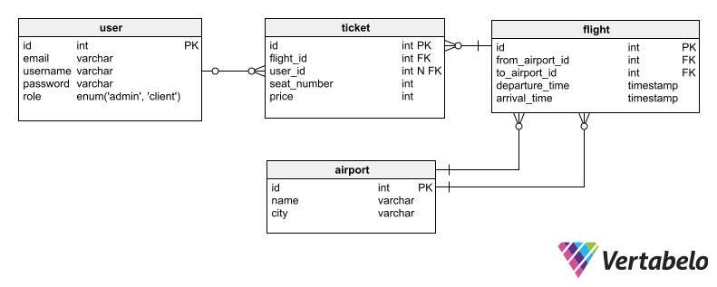

# Data Modeling

## Entity Relationship Diagram

# Data Modeling

## Contents

- [Tables](#tables)
  - [Airport](#1-airport)
  - [Flight](#2-flight)
  - [Ticket](#3-ticket)
  - [User](#4-user)
- [Relationships](#relationships)

-----

## Tables

### 1. Airport

| Key | Column Name    | Data Type | Description                |
|-----|----------------|-----------|----------------------------|
| PK  | id             | int       | Primary key for Airport    |
|     | name           | varchar   | Name of the airport        |
|     | city           | varchar   | Name of the city           |

### 2. Flight

| Key | Column Name      | Data Type | Description                           |
|-----|------------------|-----------|---------------------------------------|
| PK  | id               | int       | Primary key for Flight                |
|     | from_airport_id  | int       | Foreign key referencing Airport (from)|
|     | to_airport_id    | int       | Foreign key referencing Airport (to)  |
|     | departure_time   | timestamp | Time of flight departure              |
|     | arrival_time     | timestamp | Time of flight arrival                |

### 3. Ticket

| Key | Column Name  | Data Type | Description                        |
|-----|--------------|-----------|------------------------------------|
| PK  | id           | int       | Primary key for Ticket              |
|     | flight_id    | int       | Foreign key referencing Flight     |
|     | user_id      | int       | Foreign key referencing User       |
|     | seat_number  | int       | Seat number on the flight           |
|     | price        | int       | Price of the ticket                 |

### 4. User

| Key | Column Name | Data Type | Description                     |
|-----|-------------|-----------|---------------------------------|
| PK  | id          | int       | Primary key for User             |
|     | email       | varchar   | User's email                     |
|     | username    | varchar   | User's username                  |
|     | password    | varchar   | User's hashed password           |
|     | role        | user_role | User's role (admin or client)    |

## Relationships

- **User to Ticket - One-to-Many:**
  - One user can have many tickets, but one ticket cannot have many users.

- **Flight to Airport (From) - Many-to-One:**
  - Many flights can depart from the same airport, but each flight can depart from only one airport.

- **Flight to Airport (To) - Many-to-One:**
  - Many flights can arrive at the same airport, but each flight can arrive at only one airport.

- **Ticket to Flight - Many-to-One:**
  - Many tickets can be associated with one flight, but each ticket is associated with only one flight.

- **Ticket to User - Many-to-One:**
  - Many tickets can be associated with one user, but each ticket is associated with only one user.
